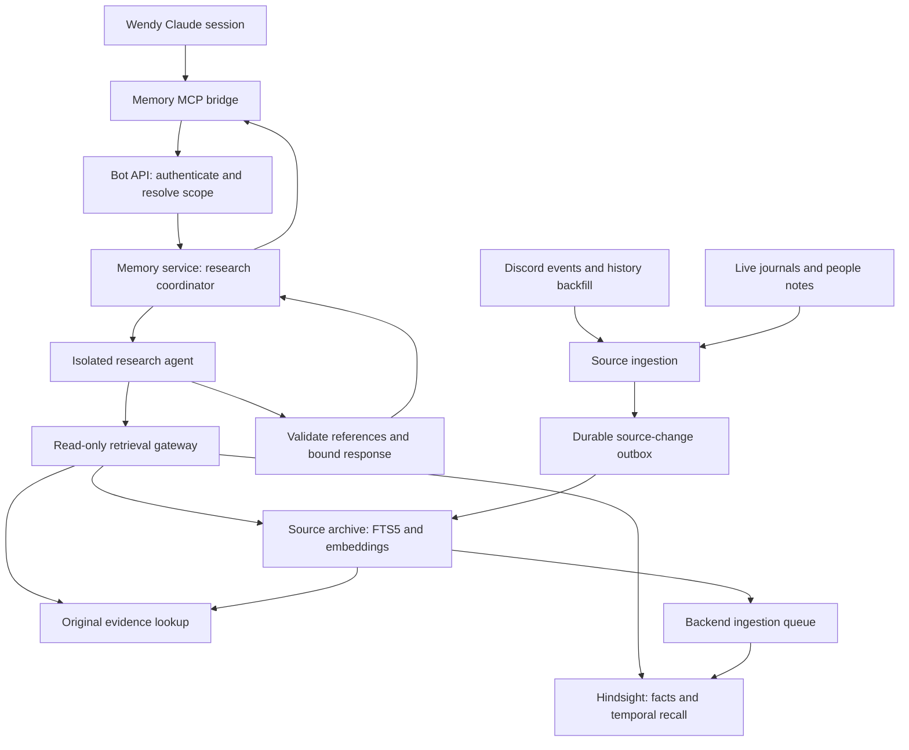

# Wendy agentic memory

Status: pilot implemented; production rollout pending. See [operations and tested
limitations](../memory-operations.md) for the current implementation.

Date: 2026-09-29.

Audience: developers implementing and operating Wendy.

## Purpose and decisions

Give Wendy a natural-language tool for researching her accumulated chat history,
journals, and people notes. A separate research agent searches and checks evidence
in its own context, then returns a concise answer with source references. Hindsight
is the first experimental memory backend and is part of the initial pilot.

The agreed stack is:

1. **Wendy's MCP tools:** `research_memory` and optional evidence expansion.
2. **A research agent:** an isolated LLM run with bounded, read-only retrieval tools.
3. **Memory systems:** Hindsight plus a searchable copy of original source records.

The original messages and files remain authoritative for what was said or written.
Hindsight supplies extracted facts, temporal associations, and connections between
records. Both feed the researcher. The implementation supports replacing or adding
a backend later; Graphiti is a possible second experiment.

Success means Wendy can ask a precise question in ordinary language and receive a
useful, attributable answer without loading the underlying research into her main
conversation. A typical response should consume hundreds of tokens.

## Current environment

The design is based on the current checkout, not an inventory of production data.

| Existing component | Consequence for this design |
| --- | --- |
| [`message_history`](../../wendy/state.py) stores Discord IDs, authors, channels, timestamps, reply IDs, and text | Use these stable identifiers and preserve conversation structure. |
| [`_save_bot_message`](../../wendy/api_server.py) stores Wendy's outgoing messages | Index both sides of a conversation and distinguish speaker roles. |
| [`journal_dir`](../../wendy/paths.py) and the [memory prompt](../../wendy/prompt.py) identify channel journals and people profiles | Index the live runtime files, including independent thread journals. |
| [`on_message` and startup catch-up](../../wendy/discord_client.py) operate on received/cached messages | Existing SQLite contents do not establish complete Discord history. Audit coverage and backfill gaps. |
| `MESSAGE_LOGGER_GUILDS` can log beyond Wendy's configured response channels | Stored data and data allowed in a memory answer need explicit separate policies. |
| [`build_cli_command`](../../wendy/cli.py) uses `--strict-mcp-config` | Pass an explicit memory MCP configuration when starting Wendy. |
| [`task_auth`](../../wendy/task_auth.py) holds scoped, ephemeral capabilities | Authenticate the bridge through the bot; do not forward Wendy's controller capability to the researcher. |
| [`worker_runtime`](../../wendy/worker_runtime.py) manages general project tasks | Create a dedicated memory runner with its own limits and tool surface. |

Claude session JSONL files contain agent activity and duplicated conversation/tool
content. They are a later, separately labeled corpus. The first pilot covers chat
text, journals, and people notes. Attachment URLs are indexed as references;
attachment contents require an explicit extraction pipeline before they count as
searchable evidence. Synthetic wakes and delivery notices are excluded.

## Architecture



Deploy `wendy-memory` as a service containing the research coordinator, source
index, and ingestion workers. Deploy a pinned Hindsight release alongside it with
its own persistent database. The MCP bridge is a small stdio process launched by
Wendy's Claude CLI; it sends authenticated requests to the existing bot API, which
forwards a trusted scope envelope to the memory service over private HTTP.

This keeps policy resolution in the bot, which already knows conversations and
sessions. The memory service owns retrieval, research execution, and backend state.
Services exchange versioned records over HTTP; they do not import one another's
internal modules. New tables in `wendy.db` have their schema defined once in
`StateManager`; the memory service owns a separate schema and database.

## Wendy's tool contract

Wendy sees two tools. Their descriptions and schemas should stay small.

### `research_memory`

| Argument | Meaning |
| --- | --- |
| `question` | Required, self-contained research question. Include people, dates, and the distinction being investigated when known. |
| `context` | Optional short explanation of the current reference, such as what “that project” means. |
| `depth` | `standard` by default; `deep` permits a larger research budget. |
| `followup_to` | Optional previous research ID for a focused follow-up. |

Illustrative request:

```json
{
  "question": "What did Jordan decide about the shelf design, and did that decision change later? Find the latest explicit decision and distinguish it from Wendy's suggestions.",
  "context": "The rail-mounted and bedside shelf designs.",
  "depth": "standard"
}
```

The server supplies current time, origin conversation, authenticated scope, and
source-coverage information. It does not implicitly copy Wendy's conversation or
read her inbox. Natural-language dates are resolved against the supplied time and
timezone. Ambiguous people are identified as ambiguous rather than silently merged.

The response has a versioned structured representation. The MCP bridge renders
one compact text result from it; it must not duplicate a large JSON payload and
the same prose in Wendy's context.

```json
{
  "research_id": "mem-example",
  "status": "answered",
  "answer": "A short synthesis with claim references [S1] and [S2].",
  "sources": [
    {
      "ref": "S1",
      "kind": "discord",
      "speaker": "Jordan",
      "date": "2026-06-12",
      "location": "#projects",
      "locator": "discord:<message-id>",
      "excerpt": "A short exact passage supporting the answer."
    }
  ],
  "limitations": [],
  "coverage": {
    "source_revision": "revision-example",
    "hindsight_state": "current",
    "truncated": false
  }
}
```

This is an illustrative schema, not actual research evidence. The service fills
source metadata and resolves Discord permalinks or file locators from its registry.
The LLM selects source references; it cannot invent valid source IDs or URLs.

The validator checks source existence, authorization, revision, and exact excerpt
matches. These checks establish citation integrity; they do not prove that a
passage supports the agent's interpretation. The researcher must make that check,
and the evaluation measures semantic support separately.

Statuses are `answered`, `partial`, `no_evidence`, and `unavailable`.
`no_evidence` means the searches found no support in the available corpus. It does
not establish that an event never happened. Timeouts, incomplete indexing, and
backend failures produce explicit limitations. Retrieval scores are relevance
signals and are never presented as probabilities that a claim is true.

### `open_memory_evidence`

Inputs: `research_id` and one or more source references returned by that run.
Return bounded original passages, authors, timestamps, and reply context.
Large results use a continuation cursor. Recheck permissions and source revisions
on every expansion; report a changed or removed source instead of serving stale
text. Follow-up research can reuse valid source references without resuming the
previous LLM session or replaying its entire search trace.

Wendy receives a brief tool-use instruction: use memory research when forgotten
context matters; state the question precisely; preserve reported uncertainty;
open evidence when exact wording matters. Search results do not automatically
become system-prompt content or new journal entries.

## Research agent

Each request starts a fresh researcher with the question, optional context,
trusted scope, time, and a task-specific prompt. It has these internal tools:

| Tool | Purpose |
| --- | --- |
| `recall_memory` | Search Hindsight and return bounded facts with provenance. |
| `search_sources` | Search original text using keyword and semantic retrieval, with optional person, channel, source-type, and date constraints. |
| `read_sources` | Read selected records and bounded neighboring/replied-to messages. |
| `inspect_coverage` | Inspect permitted corpus coverage and index lag when that affects an answer. |

The standard flow begins with Hindsight recall and source search, which may run
concurrently. The agent follows promising references, verifies decisive claims
against original records, checks for corrections or later decisions when relevant,
and returns a compact result. These are instructions for adaptive research, not a
requirement to perform every step for an obvious single-record answer.

The researcher may use prior model knowledge to formulate searches. Assertions
about Wendy's history must be supported by retrieved evidence. A journal records
Wendy's interpretation; a user's statement records that user's assertion. A newer
statement is not automatically a correction unless its meaning and attribution
support that interpretation. Preserve conflicting accounts when unresolved.

An “as of” question means the state of affairs at that date; later retrospectives
can be evidence. A question about what Wendy knew by a date additionally restricts
the evidence's observation time. Keep event time, message time, and ingestion time
distinct throughout retrieval and synthesis.

### Runtime choice

The pilot supports a direct Gemini API researcher and an isolated Claude CLI
researcher behind the same interface. Gemini is the tested default, using the
existing inference provider. The local Claude OAuth token was revoked during
validation; its runner needs a valid token before live validation. Each researcher
has its own model setting and concurrency limit. Shared Claude credentials still
share Wendy's account limits.

For Claude, use a clean working directory and explicit researcher settings. Disable built-in
tools, load only the internal retrieval MCP server, allow those named tools, and
deny interactive permission prompts. Use fresh sessions, structured output, a
turn limit, and an enforced wall-clock deadline. Do not inherit Wendy's personality
prompt, journaling hooks, sync hooks, project instructions, controller token, or
general task-worker tools. Verify the loaded tool list and configuration isolation
against the pinned CLI before enabling the pilot. The [Claude CLI reference](https://code.claude.com/docs/en/cli-reference)
documents `--tools`, `--mcp-config`, `--strict-mcp-config`,
`--no-session-persistence`, and `--json-schema`.

Use `--restricted`, empty setting sources, disabled hooks/auto memory, and a clean
HOME. Do not use `--bare` with subscription OAuth: [bare mode explicitly ignores
OAuth credentials](https://code.claude.com/docs/en/headless#start-faster-with-bare-mode).
The Gemini runner exposes the same four retrieval functions and a structured
finish function. It preserves the provider's required function-call signatures
only in the transient research context.

The researcher receives a short-lived capability accepted only by the retrieval
gateway. Tool availability is enforced by the runtime and gateway, in addition to
the prompt. The gateway exposes no file writes, Discord sends, arbitrary SQL,
shell commands, internet access, or recursive research-agent creation.

### Initial budgets

These are proposed pilot defaults, not measured performance guarantees. Store
them in configuration and tune them using observed latency and answer quality.

| Limit | Standard | Deep |
| --- | ---: | ---: |
| End-to-end deadline, including queueing | 25 seconds | 60 seconds |
| Internal retrieval calls | 8 | 16 |
| Cumulative source text admitted to research context | 12,000 tokens | 24,000 tokens |
| Maximum response returned to Wendy | 700 tokens | 1,200 tokens |
| Sources in the initial response | 3 | 6 |

Enforce byte limits as well as token estimates. Reserve budget for synthesis and
source metadata; do not truncate away a qualification while keeping its claim.
Tool-call limits are enforced by the service independently of CLI turn limits.
One schema-repair attempt is allowed within the original deadline. On cancellation
or timeout, stop the researcher and its children and revoke its capability.

Return partial verified findings when possible. If the researcher is unavailable,
return a brief failure status; do not dump raw candidate results into Wendy's
context. The first version uses bounded synchronous calls. Long-running research
jobs and notifications can be added after the interactive path is measured.

## Source archive and ingestion

The source archive is a faithful, rebuildable projection of upstream messages and
files. It supplies evidence even when a memory backend omits a detail. FTS5 is the
first exact/keyword index; add an embedding index for semantic source search.
Record the embedding model and dimensions with the index. Select the vector
storage implementation after measuring corpus size and the deployment machine.

Each normalized source record carries:

| Field group | Required information |
| --- | --- |
| Identity | Stable source ID, source kind, origin locator, content hash and revision |
| Attribution | Author ID and observed display name; human, Wendy, or external bot role |
| Conversation | Guild, channel, thread/parent, reply target, ordered message position |
| Time | Message/file observation time; event time when explicitly available; ingestion time |
| Evidence | Original text, attachment references, source-relative span information |
| Policy | Memory domain, policy revision, deletion/restriction state |

Serialize Discord snowflakes as strings. A renamed user keeps the same author ID;
aliases aid retrieval without becoming identity keys. Journal section citations
include a file revision and heading/span, since line numbers alone drift after an
edit. Resolve sources through the registry rather than accepting arbitrary paths.

### Capture and completeness

1. Inventory SQLite and runtime files: counts, earliest/latest records, channels,
   thread coverage, journal paths, and estimated text volume.
2. Export a consistent source snapshot with a change-log high-water mark. Replay
   later changes so initial indexing cannot miss concurrent edits or messages.
3. Backfill permitted Discord channels and archived threads through the bot's
   Discord access, with rate limits, resumable cursors, and source-ID deduplication.
   Missing/deleted history cannot be reconstructed; record the gap.
4. Record live message inserts, edits, and deletions in a durable outbox in the
   same transaction as the local state change. Add Discord deletion handling.
5. Scan permitted live journals/profiles by content hash. Hooks can accelerate
   discovery, but periodic reconciliation catches Bash writes, renames, and missed
   events. Stage a stable file read before committing a revision.

A message-ID-only watermark misses edits and backfilled older messages; use an
independent monotonic change sequence. Acknowledge outbox events after durable
source-index commit. Each backend has its own ingestion checkpoint and retries,
so a Hindsight outage does not delay source availability or Discord replies.

History retrieval does not change `msgs` read cursors or synthetic-delivery state.
The bot supplies an origin-conversation visibility cutoff consistent with current
manual message delivery; incoming messages Wendy has not read are not exposed
through this tool. Cross-conversation archive access follows the configured memory
domain policy. Memory search is never an alternative inbox-polling mechanism.

### Document construction for Hindsight

Keep individual messages in the source archive. Build bounded conversational
episodes for Hindsight, preserving speaker IDs/names, timestamps, message markers,
and reply relationships in the submitted text. Start with thread-local batches
bounded by a quiet interval and a configurable size limit; record the episode's
membership so edits update the same document. Never mix permission domains.

Use stable document IDs and a mapping from each document revision to its original
source records. Journal sections carry their title, document date if known, and
Wendy as author. An uncertain filename date or filesystem modification time is
not silently promoted to the time of the described event.

Index the original text before scheduling backend extraction. The queue records
document ID, source revision, content hash, backend/version, extraction settings,
attempts, and completion state. Coalesce pending edits and serialize work per
document so an older retry cannot overwrite a newer revision. Measure episode
size in the pilot; it is an implementation choice, not an established optimum.

## Hindsight integration

Hindsight's [document API](https://hindsight.vectorize.io/developer/api/documents)
provides caller-supplied document IDs and source chunks. Its
[recall API](https://hindsight.vectorize.io/developer/api/recall) exposes fact types,
document/chunk references, and supporting facts for consolidated observations.
Use this provenance to guide original-source lookup before returning claims.

The initial adapter needs these operations:

```text
upsert_document(scope, document_id, revision, content, metadata)
delete_document(scope, document_id, revision)
recall(scope, query, filters, budget) -> candidates with provenance
ingestion_status(scope) -> checkpoints, lag, failures
```

The common candidate format preserves backend-specific fact types and scores.
Raw scores from different backends are not directly comparable. Deduplicate by
source identity and use rank fusion or a common reranker where needed.

For the pilot, use Hindsight's normal extraction and `recall` path. Configure a
bank mission that preserves speaker attribution, decisions, preferences, projects,
relationships, corrections, and event timing. Recall results classified as
observations remain derived interpretations until checked against their sources.
Hindsight `reflect` is an optional evaluation variant: it adds another synthesis
step and should demonstrate a benefit before joining the default research path.
Research responses are not fed back into ingestion as new facts.

Use stable IDs with replace/upsert semantics for revised episodes. Retry a full
document version idempotently; avoid retrying append operations without a verified
deduplication contract. Track asynchronous extraction through completion instead
of treating request acceptance as searchable memory. These behaviors are described
by the [retain API](https://hindsight.vectorize.io/developer/api/retain).

Pin the server image and client/API contract together. Contract-test retain,
recall provenance, updates, deletion, and restart recovery on that exact release.
Current docs contain inconsistent descriptions of raw-text retention: the retain
overview says only facts are stored, while the document API and
[configuration guide](https://hindsight.vectorize.io/developer/configuration)
describe stored source text/chunks. Our source archive guarantees evidence access
independently; the release test establishes which Hindsight features are usable.

The [retain architecture guide](https://hindsight.vectorize.io/developer/retain)
also notes that successful extraction can produce zero facts, making a document
unreachable through recall. Count and inspect those cases. Extraction settings
must not silently become the only gate on whether history can be found.

## Access, corrections, and deletion

A memory domain groups records with the same intended audience. Start with one
Hindsight bank per domain. The bot resolves allowed domains from the authenticated
conversation and administrator configuration; neither the question nor the
researcher chooses its own permissions. A global people profile needs an explicit
sharing policy because it may contain observations originating in private channels.

Search across all domains allowed to the caller. Research can combine results in
its transient context, while persistent backend consolidation stays inside each
domain. Hindsight tags are useful for retrieval constraints; they are not the sole
authorization boundary. In particular, metadata fields are not server-side recall
filters according to the [Hindsight FAQ](https://hindsight.vectorize.io/faq).

The gateway checks scope before retrieval and before returning evidence. It also
rejects stale or deleted source revisions referenced by derived facts. A mixed
observation whose supporting sources are not all authorized is withheld. When
permissions shrink, retire or rebuild affected banks before allowing their derived
observations; post-filtering snippets alone cannot remove information already
mixed into a generated summary.

Apply the origin-conversation visibility cutoff to derived candidates as well as
raw text before giving either to the researcher. If provenance only identifies an
episode containing unread messages, withhold that candidate until more precise
source attribution or an updated read cutoff makes it eligible.

Edits replace the searchable source revision and queue all affected episodes for
refresh. Deletion creates a tombstone immediately, invalidates cached research,
and queues removal of associated backend documents and derived memories. Verify
deletion of consolidated observations in the pinned backend; disable the affected
bank until a rebuild if that removal cannot be established. Apply tombstones on
restore before serving queries. An audit trail can retain IDs and hashes without
retaining deleted content.

Retrieved chat text, including instructions quoted inside it, is untrusted evidence.
The researcher's restricted tools make this operationally enforceable. Authentication
secrets are supplied only to the processes that need them and never appear in tool
arguments, prompts, source records, or logs.

## Deployment and observability

Proposed persistent layout:

| Owner | Data |
| --- | --- |
| Existing `wendy_data` | Authoritative journals/profiles and `wendy.db`, including source-export outbox |
| Memory service volume | Source projection, FTS/vector indexes, backend manifests, scoped research records |
| Hindsight volume | Hindsight database and extraction state |

Use private service networking and explicit service credentials. The memory MCP
bridge authenticates to the bot with Wendy's existing capability. The bot forwards
a validated caller envelope using a separate service credential. The researcher
receives only a narrower retrieval capability. Revalidate scope for cached results
and evidence expansion; bind research records to policy and source revisions.

The memory image includes the researcher runtime and dependencies; it receives
only the required model authentication. Hindsight additionally needs configured
LLM, embedding, and reranking providers. Wendy's Claude CLI credentials should not
be assumed to work as Hindsight provider credentials. Choose and configure those
providers explicitly, and measure extraction spend before a full-history import.
Self-hosting storage does not imply local inference.

Pin deployable versions rather than floating image tags. Choose Hindsight's full
or slim deployment after checking host resources and provider availability;
the [installation guide](https://hindsight.vectorize.io/developer/installation)
documents both. Provider credentials stay in server secrets. Models, budgets,
domain mappings, backend selection, and retention periods are configuration.

Record per request: research ID, caller/domain IDs, source/backend checkpoints,
model and prompt versions, query counts, durations, token usage, citations,
termination reason, and failure/degradation state. Keep fetched evidence and tool
traces in a permission-protected store with a configurable retention period; a
proposed default is seven days. Store tool inputs/outputs and the final result,
without requiring private model reasoning. Never ingest research traces as history.

Brain can show a compact memory-research event and offer a scoped drill-down into
that trace. Ordinary logs and Wendy's context receive compact metadata. Track raw
index freshness separately from Hindsight extraction freshness. A successful raw
fallback must still report that Hindsight was unavailable.

## Evaluation and rollout

Build a versioned set of roughly 60 representative Wendy questions, with expected
supporting source IDs, acceptable answers, and explicit unknowns. Include direct
quotes, paraphrases, speaker ambiguity, aliases, changed decisions, historical
state, current state, cross-session reasoning, chat/journal disagreement, edits,
deletions, and permitted/forbidden cross-channel retrieval. Keep a held-out portion
untouched by prompt and extraction tuning.

Compare these modes with the same researcher model, questions, source snapshot,
prompt version, and research budget:

| Mode | Retrieval available to researcher |
| --- | --- |
| Source baseline | Keyword/semantic source search and evidence lookup |
| Hindsight | Hindsight recall and evidence lookup |
| Combined, proposed default | Both retrieval routes and evidence lookup |
| Later experiment | Graphiti or Hindsight reflect under an explicitly recorded configuration |

Measure whether all necessary evidence was found, final answer correctness,
citation support, correct abstention, temporal/speaker attribution errors,
response tokens delivered to Wendy, p50/p95 latency, failed requests, index lag,
and ingestion/query cost. Manually inspect failures and a sample of successes;
an automated judge score alone is insufficient. Report categories separately.

Pilot acceptance requires working end-to-end Hindsight research, traceable claims,
enforced response/deadline limits, observed ingest freshness, restart recovery,
and passing access/edit/deletion tests. There must be no unsupported references or
cross-domain disclosures in the acceptance suite. Choose quality and operating
cost targets after establishing the source baseline; do not invent a universal
benchmark threshold. Record whether Hindsight adds value, and on which questions,
even if the experiment favors the baseline.

Implementation proceeds in these stages:

1. **Inventory and contract spike.** Measure the corpus and host. Pin Hindsight
   and researcher versions. Validate a small synthetic multi-speaker corpus through
   retain, recall, source expansion, replacement, deletion, and restart. Establish
   provider access and model cost before importing real history.
2. **Source pipeline.** Implement the snapshot/outbox protocol, file reconciliation,
   source registry, exact retrieval, scope policy, and coverage reporting. Add
   semantic source search and resume-safe Discord backfill.
3. **Complete three-layer pilot.** Connect source ingestion to Hindsight, the isolated
   researcher, and Wendy's MCP tools. Enable for a selected memory domain and run
   the evaluation matrix. Hindsight is required in this milestone.
4. **Expand corpus and operate.** Import remaining permitted history with cost/rate
   limits. Add Brain diagnostics, recovery runbooks, retention, and backups. Tune
   extraction/retrieval from recorded failures; trial another backend when useful.

Rollback disables the memory MCP tools and stops research requests while preserving
source data and ingestion checkpoints. Backend upgrades use a new index/bank
generation, run the fixed evaluation set, and switch only after verification.

## Proposed implementation map

These paths are a suggested module split, not files created by this document.

| Area | Responsibility |
| --- | --- |
| `wendy/memory_export.py` | Source snapshots, file manifests, and change export |
| `wendy/state.py` | Source-change outbox schema and transactional message changes |
| `wendy/discord_client.py` | Edit/delete capture and resumable history collection |
| `wendy/api_server.py` | Authenticate public memory calls and resolve caller scope |
| `wendy/memory_mcp.py` | Thin stdio bridge exposing the two Wendy tools |
| `wendy/cli.py` | Explicit MCP configuration and tool permissions for Wendy |
| `services/memory/` | Research coordinator, runner, retrieval gateway, source index, and backend adapters |
| `config/memory_researcher.txt` | Research instructions and evidence requirements |
| `config/memory.json` | Budgets, model selection, domain policy, and backend settings; no secrets |
| `deploy/` | Pinned memory/Hindsight services, networks, volumes, and secret references |
| `tests/` and `services/memory/tests/` | Export, authorization, provenance, cancellation, and backend contract tests |
| `evals/memory/` | Versioned questions, source manifests, runners, and comparison reports |

The implementation must also review existing hook matching: memory MCP calls need
appropriate conversation-boundary behavior, and the researcher must not inherit
those hooks. Memory reads must leave manual delivery and journal maintenance under
their existing explicit policies.

## Decisions to resolve during the first spike

The three-layer architecture, Hindsight pilot, original-source provenance, and
bounded response are decided. The following need deployment evidence:

- Which channels and profiles share a memory domain, including thread visibility.
- Actual history size, missing intervals, and accessible archived threads.
- Researcher model and Hindsight model providers, credentials, and operating budget.
- Exact Hindsight/CLI versions and verified update, deletion, and isolation behavior.
- Episode size, source embedding model/storage, and host resource allocation.

Until configured, the pilot uses a single explicitly selected domain. Broader
access and a full-history extraction run require an explicit domain map and budget.

## Research informing the design

- [Does Memory Need Graphs? (ACL 2026)](https://aclanthology.org/2026.acl-long.1232/)
  found that graph benefits depend on representation and retrieval choices. Its
  results support testing graph retrieval while retaining rich source context.
- [GroupMemBench (2026 preprint)](https://arxiv.org/abs/2605.14498) highlights speaker
  attribution and group-conversation structure, directly relevant to Discord.
- [LongMemEval-V2 (2026 preprint)](https://arxiv.org/abs/2605.12493) evaluates agents
  gathering compact evidence from large experience histories, supporting the
  separate researcher interface.
- [Hindsight paper](https://arxiv.org/abs/2512.12818) motivates structured temporal
  recall and the distinction between evidence and synthesized observations.
- [Graphiti](https://github.com/getzep/graphiti) is a candidate for a later temporal
  graph comparison behind the same retrieval interface.

Published scores establish useful experiments, not a ranking of performance on
Wendy's corpus. The pilot's reproducible comparisons determine the deployment.
